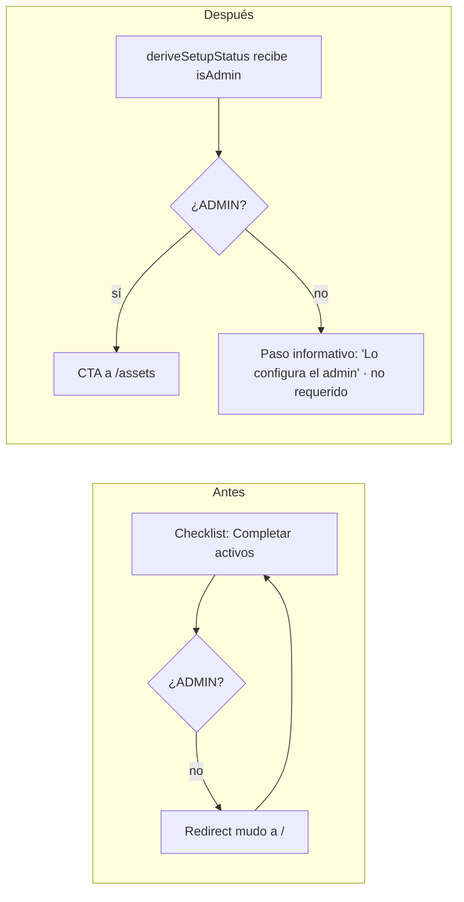
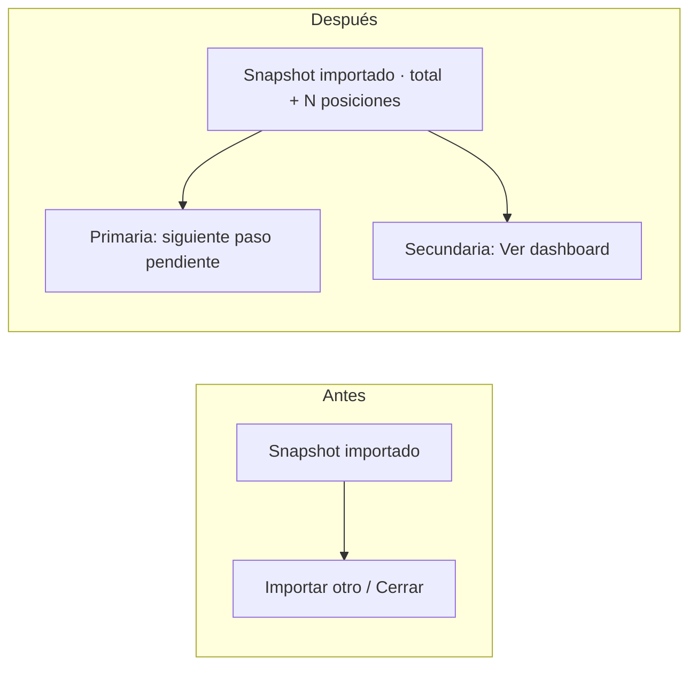

# UX Audit — 2026-10-04 — Recorrido completo

## Summary

Recorrido de las 21 pantallas y 8 flujos reconstruidos ([flows.md](../flows.md),
[screens.md](../screens.md)) contra PRN-01..24 y la matriz de estados de
`designing-user-experience`. Evaluación sobre código (no hubo navegación en vivo).

**Lo que está bien:** el orden del onboarding pone el primer valor (snapshot) primero;
el import de snapshot tiene preview, autodetección de fecha y autocompletado de CCL;
todas las rutas tienen `loading.tsx`; los estados vacíos de casi todas las páginas
explican y ofrecen acción; el reporte IA maneja bien la espera larga (estimación +
cancelar); borrar assets/transacciones/dividendos pide confirmación con AlertDialog.

**Severidad:** 4 catastrófico · 3 mayor · 2 menor · 1 cosmético.

## Findings register

| ID | Sev | Heurística | Nodo | Qué se rompe | Evidencia |
|----|-----|-----------|------|--------------|-----------|
| F-01 | 3 | PRN-09, PRN-01 | FLW-02 · paso Assets | Paso **requerido** apunta a `/assets`, que es admin-only. Un USER es redirigido a `/` sin mensaje: el checklist nunca se completa y "Completar activos" parece no hacer nada. Lo mismo desde el empty state de Análisis y el link "Hitos" (`/settings`) en `/datos`. | `lib/setup-status.ts:128`, `proxy.ts:5-10,41-47`, `app/(app)/analysis/page.tsx:78`, `app/(app)/datos/page.tsx` |
| F-02 | 3 | PRN-03 | FLW-02 · Wizard | "Más tarde" no descarta: el modal se reabre en **cada** visita al dashboard hasta "Omitir" o "Finalizar". La diferencia entre "Omitir" y "Más tarde" no se explica. | `welcome-wizard.tsx:171-177`, `lib/setup-status.ts:188` |
| F-03 | 3 | PRN-03, PRN-05 | FLW-03 · snapshot importado | Un snapshot con fecha o CCL equivocados es permanente: `deleteSnapshot` existe pero no tiene UI. Encima bloquea re-importar esa fecha. (Decisión abierta D2.) | `app/actions/snapshots.ts:285`, sin usos en `components/` |
| F-04 | 2 | PRN-05 | FLW-03 · preview | El duplicado de fecha se detecta recién al **confirmar**, después de revisar la tabla. Debería avisarse en el paso 1 (al elegir la fecha). | `app/actions/snapshots.ts:238-247` vs `parseSnapshotPreview` |
| F-05 | 2 | PRN-16, PRN-17 | FLW-02 · SCR-05 done | Tras el primer snapshot (pico emocional: primer valor) la pantalla sólo ofrece "Importar otro" / "Cerrar". No dice qué cambió ni cuál es el siguiente paso (Assets). | `import-csv-sheet.tsx` paso `done` |
| F-06 | 2 | PRN-09 | FLW-04 | Los errores de import de movimientos son toasts que se auto-cierran (~4 s). El único detalle del fallo desaparece. | `import-movements-button.tsx:87,91,137` |
| F-07 | 2 | PRN-09, PRN-02 | FLW-01 | Login muestra "Registrate" siempre; con signup cerrado `/register` redirige a login sin explicación (bucle mudo). | `login-form.tsx:120`, `register/page.tsx:9` |
| F-08 | 2 | PRN-07 | FLW-01 | Deep links no sobreviven al login: `proxy` no guarda la ruta pedida y el login siempre va a `/`. | `proxy.ts:35`, `login-form.tsx:36` |
| F-09 | 2 | PRN-04, PRN-08 | SCR-13, SCR-14 | "Importar CSV" (snapshot) es la acción del header en Performance y Historial CCL, donde el trabajo es otro. En CCL el empty state ofrece además ese botón junto a "Actualizar CCL". | `ccl/page.tsx:25,38`, `performance/page.tsx:58` |
| F-10 | 2 | PRN-03 | FLW-08 | Borrar hitos y objetivos de rebalanceo es inmediato, sin confirmación ni undo (inconsistente con assets/transacciones). | `milestones-client.tsx:61`, `rebalance-client.tsx:95` |
| F-11 | 2 | PRN-01 | FLW-08 | Restaurar versión de estrategia termina con "Recargá para ver los cambios": la app delega al usuario el refresco. | `strategy-editor.tsx:52` |
| F-12 | 2 | PRN-10 | SCR-16 sección 3 | Históricos bloqueados muestran texto ("necesitás un snapshot y transacciones") sin CTA a lo que falta. | `datos/page.tsx` sección 3 |
| F-13 | 1 | PRN-04 | SCR-04 | Bienvenida dice "4 tipos de datos"; el wizard tiene 6 pantallas y el checklist 5 pasos. | `welcome-wizard.tsx:53` |
| F-14 | 1 | PRN-04 | SCR-16 | El ítem "Importar snapshot" del checklist en `/datos` navega a `/` en vez de abrir el sheet como en el dashboard. | `datos/page.tsx` (`SetupChecklist` sin `onImportSnapshot`) |
| F-15 | 1 | PRN-08 | SCR-06, SCR-03 | Botones "Importar CSV" duplicados en la misma vista (header + cuerpo). | `snapshots/page.tsx:20,32`, `page.tsx` |
| F-16 | 1 | PRN-01 | SCR-05 | Mientras se autocompleta el CCL, el botón muestra "Analizando…" (comparte `isPending`). | `import-csv-sheet.tsx:150-163` |
| F-17 | 1 | Mobile | SCR-06 | En mobile la lista de snapshots oculta el valor ARS/USD (`hidden sm:flex`): sólo fecha y %. | `snapshots/page.tsx` |

## Propuestas (las de mayor impacto)

### P-01 → F-01: el checklist respeta el rol
Si el usuario no es ADMIN, el paso Assets pasa a "lo completa el administrador"
(no bloquea, no cuenta como requerido para el usuario) y no se muestran links a
rutas admin. Cita PRN-09, PRN-05. **Efecto observable:** un USER puede llegar a
"Configuración completa"; cero redirects silenciosos desde CTAs.

### P-02 → F-02, F-13: "Más tarde" posterga de verdad
"Más tarde" cierra por la sesión (o 7 días) y el checklist queda como recordatorio;
"Omitir" pasa a "No mostrar más". Copy de bienvenida alineado con los pasos reales.
Cita PRN-03, PRN-18 (Zeigarnik honesto: el checklist ya marca lo abierto).

### P-03 → F-05: cerrar el primer valor
En `done`, mostrar total importado y el siguiente paso pendiente del checklist como
acción primaria ("Siguiente: completar activos →"), con "Cerrar" secundario.
Cita PRN-16, PRN-17.

### P-04 → F-03, F-04: corregir un snapshot mal cargado
- Validar duplicado en `parseSnapshotPreview` y mostrarlo en el paso 1 junto al campo fecha.
- En SCR-07 (detalle), "Eliminar snapshot" con AlertDialog que nombre fecha y
  cantidad de posiciones ("Eliminar el snapshot del 04 may 2026 (12 posiciones)?
  No se puede deshacer"). Respeta la inmutabilidad (no se edita; se borra y re-importa).
  **Requiere decidir D2.**

### P-05 → F-06, F-07, F-08, F-10, F-11: higiene de errores y control
- Errores de import como alerta inline persistente (no toast).
- Ocultar "Registrate" si el signup está cerrado.
- `callbackURL` en el redirect del proxy y uso en el login.
- Undo en toast (8–10 s) para hitos/objetivos.
- `router.refresh()` tras restaurar estrategia.

## Scope and limits
- Evaluación estática sobre código; no se navegó la app ni se probó con red lenta.
- Sin `foundation.md`: los jobs son provisionales. Sin Figma.
- Pantallas Performance, CCL, Jubilación, Guía y Transacciones se revisaron en sus
  estados vacíos y acciones principales, no en detalle de cada control.

## Verdict
App sólida en el camino feliz y en estados vacíos. Los problemas de mayor peso están
en **permisos vs onboarding (F-01)**, **control del usuario sobre el wizard (F-02)** y
**recuperación de un snapshot mal cargado (F-03/F-04)**. Ninguna propuesta se aplica
sin aprobación; las aprobadas pasan a `docs/ux/plans/2026-10-04-<scope>.md`.

## Re-auditoría tras aplicar el plan (2026-10-04)

Plan: [plans/2026-10-04-recorrido.md](../plans/2026-10-04-recorrido.md). Verificación:
`npm run lint` (0 errores; 10 warnings previos, ninguno nuevo), `tsc --noEmit` limpio,
`npm test` 58/58, `npm run build` OK. Sin prueba manual en navegador.

| ID | Resultado | Cómo |
|----|-----------|------|
| F-01 | fixed | `SetupStep.actionable` + `canManageAssets`; paso Assets informativo para USER (test nuevo); links a `/assets` y `/settings` ocultos para USER en wizard, checklist, Análisis, Ganancia Real y `/datos`. |
| F-02 | fixed | "Más tarde"/cerrar posterga por sesión del navegador (`sessionStorage`, degrada a mostrar el wizard si no hay storage); "Omitir" → "No mostrar más". |
| F-03 | fixed | `DeleteSnapshotButton` en el detalle, con confirmación nombrando fecha y posiciones. |
| F-04 | fixed | `checkSnapshotDate` al elegir la fecha + chequeo en `parseSnapshotPreview`. |
| F-05 | fixed | `importSnapshot` devuelve `totalValueArs` y `nextStep`; la pantalla de éxito los muestra con CTA primaria. |
| F-06 | fixed | Errores inline persistentes (lectura bajo el botón, guardado dentro del diálogo). |
| F-07 | no_change_needed | **Falso positivo de la auditoría:** el link "Registrate" ya estaba condicionado a `allowSignup`. |
| F-08 | fixed | `proxy` agrega `?next=`; el login vuelve ahí, validando que sea ruta interna. |
| F-09 | fixed | CCL: header "Actualizar CCL"; Performance: import sólo en el empty state. |
| F-10 | fixed | Borrado diferido con "Deshacer" (8 s) en hitos y objetivos. |
| F-11 | fixed | El editor toma el contenido restaurado; se quitó "Recargá". |
| F-12 | fixed | CTA en la sección 3 de `/datos`. |
| F-13 | fixed | Copy de bienvenida sin número fijo; paso "Objetivos" agregado al wizard. |
| F-14 | fixed | `/datos` usa `SetupPanel` (sin wizard), que abre el sheet. |
| F-15 | fixed (parcial, justificado) | Snapshots: un solo botón. Dashboard conserva el bloque del pie: la página es larga y el header queda fuera de vista. |
| F-16 | fixed | Transición separada para la búsqueda de fecha/CCL ("Verificando fecha..."). |
| F-17 | fixed | Valores visibles en mobile. |
