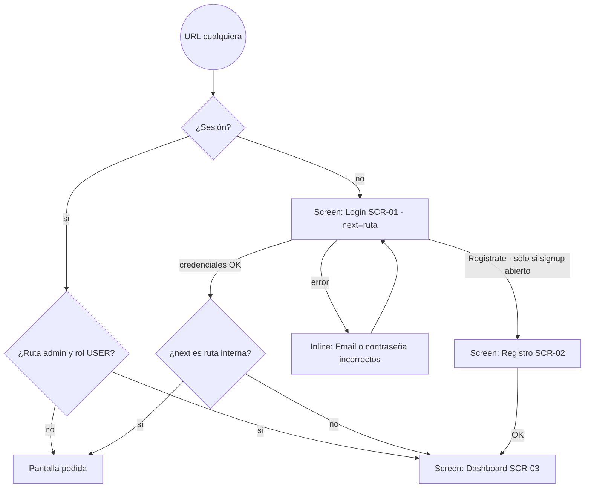
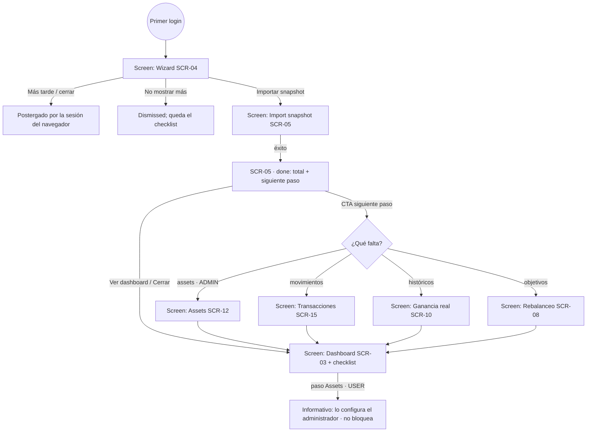
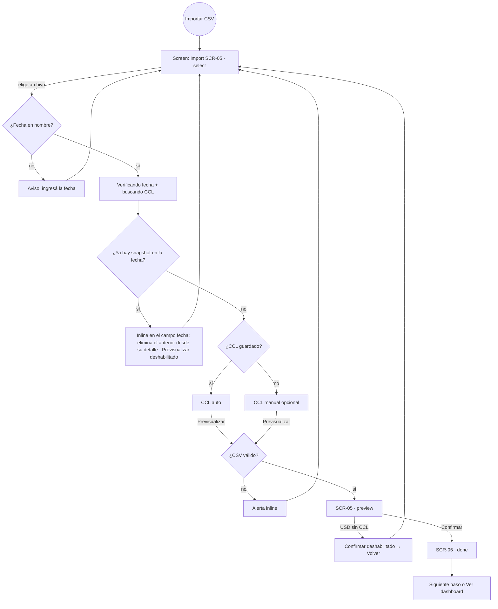
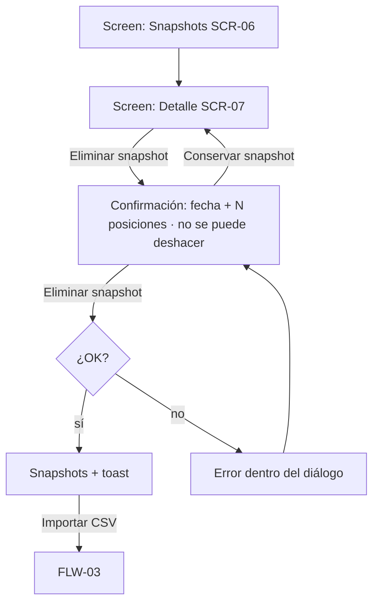
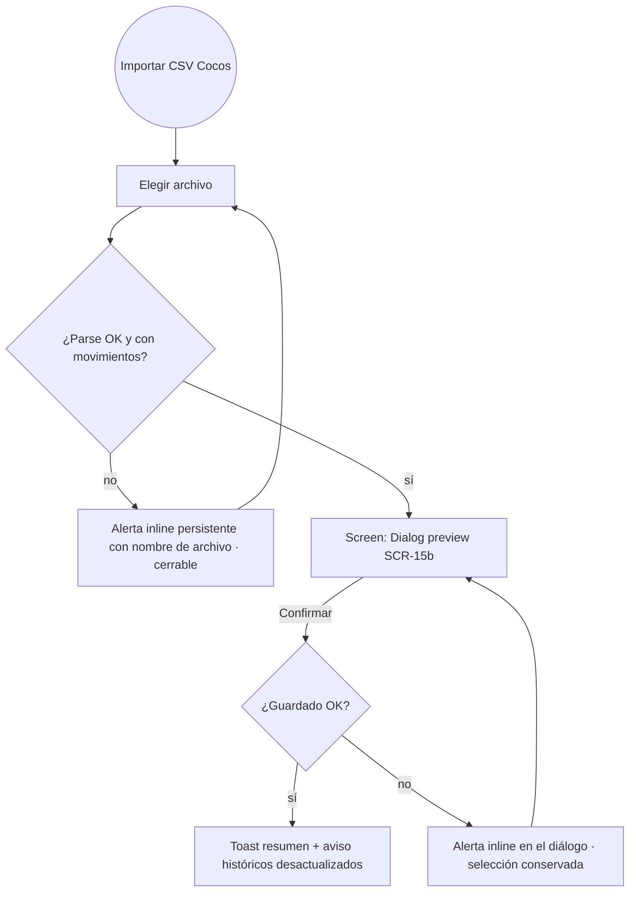
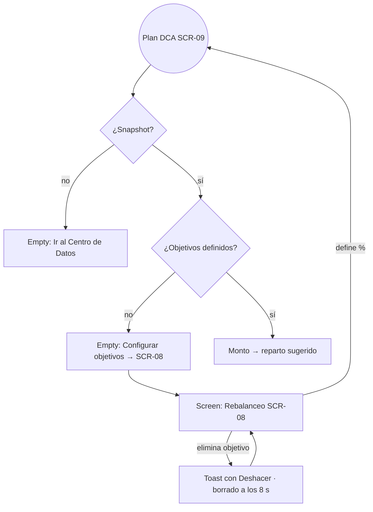

<!-- Managed with super-ux (ux-contract v4). The HOW layer:
task analysis and user flows scenarios trace to. -->

# Flujos de usuario — Portfolio Jubilación

> Reconstruidos en modo Reverse (2026-10-04) y actualizados el mismo día tras
> aplicar el plan [plans/2026-10-04-recorrido.md](plans/2026-10-04-recorrido.md).
> Siguen como `inferred`: falta confirmarlos con el uso real.
> No existe `foundation.md`: los `Traces:` son **jobs provisionales sin respaldo**
> escritos en palabras del usuario; se reemplazan por `JTBD-NN`/`ST-NNN` cuando se
> haga `ux-foundation`.
>
> Hallazgos: [audits/2026-10-04-recorrido.md](audits/2026-10-04-recorrido.md).
> Pantallas: [screens.md](screens.md).

## Perfil provisional

| Dimensión | Valor | Fuente |
|---|---|---|
| Usuario principal | Inversor individual de largo plazo, CEDEARs en Cocos Capital, rol ADMIN | brief (CLAUDE.md) |
| Usuarios secundarios | Cuentas `USER` (signup cerrado por defecto) — **caso real** (D1) | decisión 2026-10-04 |
| Frecuencia | Mensual (importar snapshot), ocasional (análisis) | docs/flujo-de-uso.md |
| Dispositivo | Desktop principalmente; layout responsive con sidebar colapsable | inferred |
| Monetización | Ninguna | assumed |
| Web pública | **No** — todo detrás de login | inferred (`proxy.ts`) |

**Decisiones tomadas (2026-10-04)**
- D1 — Los `USER` son un caso real: el checklist respeta el rol y no hay CTAs hacia rutas admin para ellos.
- D2 — Un snapshot mal cargado se elimina y se reimporta (consistente con ADR-0004; no se edita).

---

### FLW-01: Acceso a la app `inferred`
- **Traces:** provisional — "entrar a ver mi cartera"
- **Goal:** usuario autenticado en la pantalla que pidió
- **Entry points:** cualquier URL sin sesión (redirige a `/login?next=<ruta>`); `/register` si `ALLOW_PUBLIC_SIGNUP=true`
- **Success exit:** la ruta pedida (o SCR-03 Dashboard)
- **Flow:**

- **Evidencia:** `proxy.ts` (param `next`), `app/(auth)/login/page.tsx` (`safeNext`), `login-form.tsx` (`redirectTo`, link condicionado a `allowSignup`).
- **Screens traversed:** SCR-01 (success, error) · SCR-02 (success, error) · SCR-03 (loading, success)

### FLW-02: Primer uso / puesta en marcha `inferred`
- **Traces:** provisional — "dejar la app lista para que me muestre mi cartera"
- **Goal:** pasos accionables del checklist completos (snapshot + assets para ADMIN; snapshot para USER)
- **Entry points:** primer login (wizard auto-abierto); checklist en dashboard y `/datos`; estados vacíos; pantalla de éxito del import
- **Success exit:** checklist "Configuración completa"
- **First value:** el snapshot desbloquea el dashboard y la pantalla de éxito encadena el siguiente paso.
- **Task analysis:**
  1. Leer bienvenida (wizard, 7 pantallas: bienvenida + 5 pasos + fin)
  2. Importar CSV de Portfolio → **primer valor**
  3. Completar ratio/subyacente/sector (ADMIN) · informativo para USER
  4. Importar CSV de Actividad
  5. Cargar CCL + precios históricos
  6. Definir objetivos / plan de retiro
- **Flow:**

- **Evidencia:** `lib/setup-status.ts` (`actionable`, `canManageAssets`), `components/setup/setup-panel.tsx` (snooze en `sessionStorage`), `welcome-wizard.tsx`, `import-csv-sheet.tsx` (paso `done`), `app/actions/snapshots.ts` (`nextStep`).
- **Screens traversed:** SCR-03 (empty, success) · SCR-04 · SCR-05 (select, preview, done, error) · SCR-12 · SCR-15 · SCR-10 · SCR-08 · SCR-16

### FLW-03: Registrar el snapshot mensual `inferred`
- **Traces:** provisional — "guardar cómo está mi cartera este mes"
- **Goal:** nuevo `PortfolioSnapshot` inmutable con CCL de esa fecha
- **Entry points:** "Importar CSV" en header de Dashboard, Snapshots, Rebalanceo, Análisis; empty state de Performance; card en `/datos`; checklist; bloque "Actualizar portfolio" al pie del dashboard
- **Success exit:** SCR-05 done → siguiente paso o dashboard
- **Flow:**

#### FLW-03b: Corregir un snapshot mal cargado

### FLW-04: Importar movimientos (Actividad) `inferred`
- **Traces:** provisional — "que la app sepa a cuánto compré"
- **Entry points:** `/transactions` header; card en `/datos`; checklist; CTA de la sección 3 bloqueada en `/datos`
- **Flow:**

### FLW-05: Medir ganancia real `inferred`
- **Entry points:** sidebar; tarjeta en dashboard; checklist; `/datos` sección 3
- **Flow:** `RealGainsWizard` → CCL histórico → precios históricos → KPIs + tabla. Si falta algo, `/datos` muestra el CTA que corresponde (importar snapshot o movimientos). Links a Assets en la tabla sólo para ADMIN.

### FLW-06: Decidir la próxima compra `inferred`
- **Entry points:** sidebar Rebalanceo / Plan DCA; tarjeta en dashboard; paso 5 del wizard
- **Flow:**

### FLW-07: Reporte de oportunidades con IA (admin) `inferred`
- **Flow:** Generar reporte (usa el último snapshot; segundos, con cancelar) → señal compra / mantener / venta por acción + historial.

### FLW-08: Mantenimiento admin `inferred`
- **Flow:** Assets (CRUD con confirmación) · Estrategia (nueva versión / restaurar: el editor se alinea solo con la versión restaurada) · Configuración (hitos: borrar con Deshacer, borrado a los 8 s).
